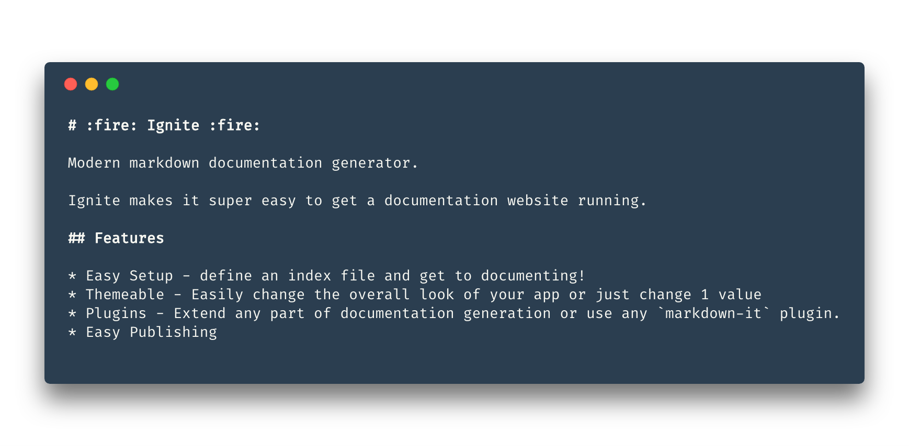
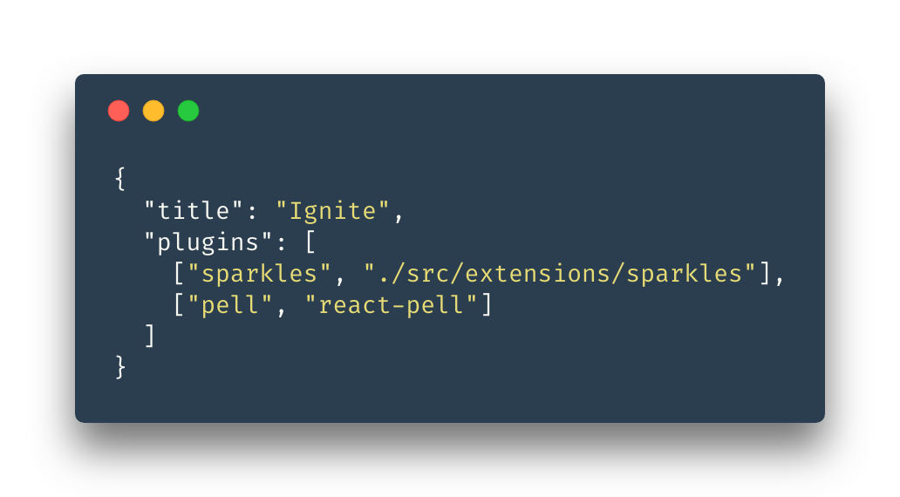
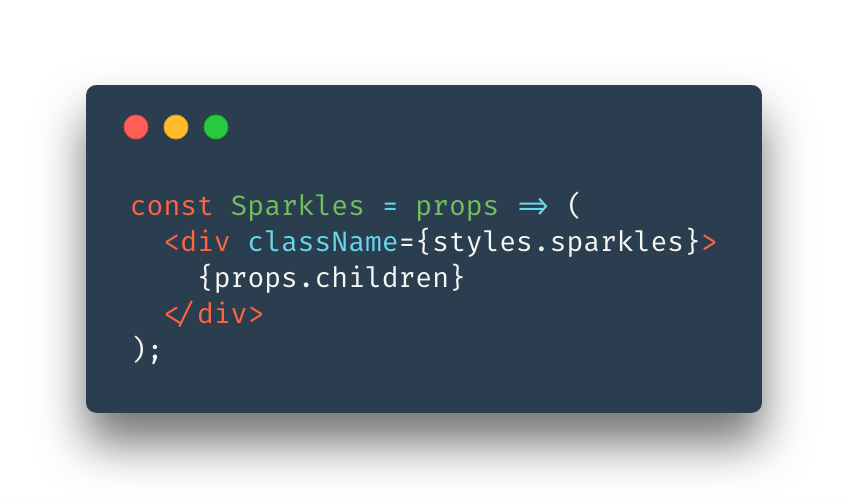
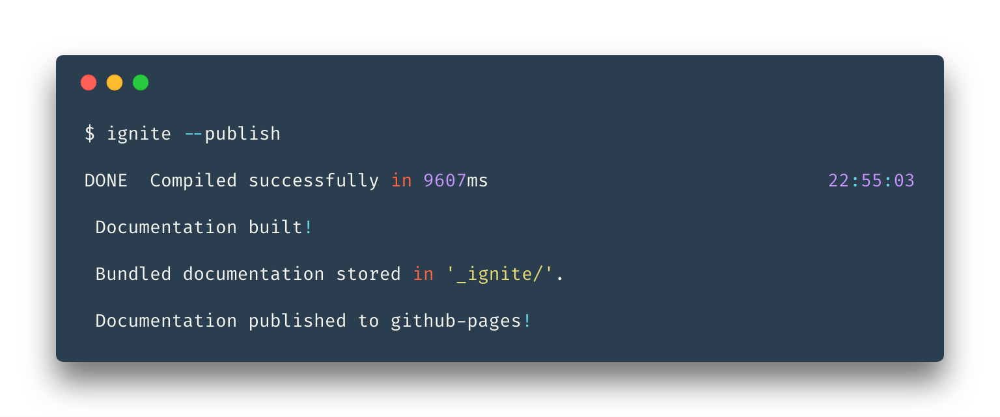
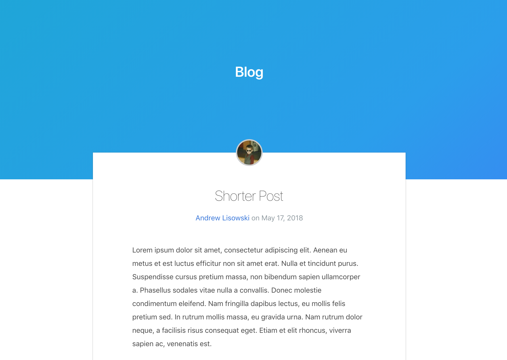

::: hero is-primary is-bold is-medium has-text-centered

# Ignite

## Zero Hassle Documentation

:::

## Finally, a markdown documentation generation tool built around plugins. /.no-link .has-text-primary .has-text-centered\

Ignite makes documenting your open source project as easy as adding files to a folder. The barrier to writing documentation should be low, encouraging us to write more of it! /.has-text-centered\

||| row has-text-centered wide

::: box

### Plugins

Just write React Components
:::

::: box

### Themeable

Built on [Bulma](https://bulma.io/documentation/overview/customize/)
:::

::: box

### Blog

Great for things that aren't quite documentation but need explanation.
:::

::: box

### Deploy With Git

Always have old documentation available
:::

|||

::: hero is-info is-small has-text-centered
Using Ignite
:::

::::: hero is-small
:::: div columns
::: div column feature

# Write Markdown

:::
::: div column

:::
::::
:::::

::::: hero is-light is-small
:::: div columns
::: div column featureImages

:::
::: div column feature

# Add Plugins

Ignite uses React, so we thought the simplest plugin system would just be plain old React components.

This means any react component can be exposed as a plugin for Ignite. The possibilities for expressive documentation are endless! Read more [here](pages/IgnitePlugins.md)

:::
::::
:::::

::::: hero is-small
:::: div columns
::: div column feature

# Deploy

Ignite has Github-Pages publishing **built in** and setup is [easy](pages/Publishing.md)
:::
::: div column

:::
::::
:::::

::: hero is-info is-small has-text-centered
Blog
:::

Blogging shouldn't be hard either! Why host posts about your product anywhere but with your documentation? All information about your project should be accessible from one easy to search location. Ignite makes this easy.

 

::::: hero is-small is-light no-margin
:::: div columns
::: div column feature

# Just Add Posts to `blog/`

Ignite will generate a blog for you and add an item to the header
:::
::: div column fadeBottom

:::
::::
:::::

:::: hero is-link is-small has-text-centered

# Even this pages is markdown. What are you waiting for? /.no-link .title .is-4 .has-text-centered\

::: button is-large is-link is-bold is-inverted is-outlined
[Get Started :tada:](pages/GettingStarted.md)
:::

::::
